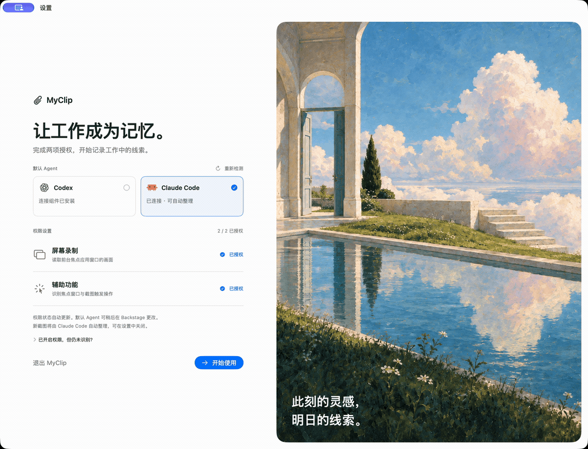

<div align="center">
  
  <h1 align="center">MyClip</h1>

  <p align="center">
    MyClip helps you remember what you were working on. It captures the focused window or its display on your Mac and uses Codex or Claude to turn screenshots into searchable notes, connected knowledge, and suggested tasks.
  </p>
</div>

<p align="center">
  <strong>English</strong> · <a href="docs/README.zh-CN.md">简体中文</a> · <a href="docs/README.es.md">Español</a> · <a href="docs/README.fr.md">Français</a> · <a href="docs/README.de.md">Deutsch</a> · <a href="docs/README.ja.md">日本語</a> · <a href="docs/README.ko.md">한국어</a>
</p>

<p align="center">
  
</p>
<p align="center"><sub>Recorded in the installed MyClip macOS app · Local library · Chinese interface.</sub></p>

## What you can do

- **Revisit your work.** Browse a screenshot timeline and check the sources behind your notes. Every screenshot has a local OCR text document you can view, copy, or open.
- **Build a personal knowledge library.** Search, edit, and link notes across projects, topics, and daily work. Your notes are Markdown files you can open in other editors.
- **Keep track of next steps.** Review suggested tasks, confirm what matters, and follow progress on a task board. Switch between **Kanban** and **Reports** to review daily, weekly, or monthly work reports grouped by project and progress.
- **Give your AI tools context.** Let Codex, Claude Code, Claude Desktop, Cursor, or OpenCode search your saved memories.

## Get started

Requires **macOS 13 or later** and a **Codex or Claude account**. Installing the agent connector also requires **Node.js 22 or later**. Local build instructions are below.

1. Open MyClip and go to **Backstage** in the sidebar. Install a connector, sign in, and click **Connect** to verify it is available. Then click **Enable** to use that agent for organization. Connecting alone does not start tasks; multiple agents can be connected, but only one is enabled at a time.
2. Grant **Screen Recording** and **Accessibility** permissions. Capture starts automatically whenever MyClip is open, including after permissions are granted.
3. Work as usual. By default, MyClip captures the focused window after a click following one second of pointer stillness, after two seconds without vertical scrolling, or after a letter key followed by Return. Automatic organization turns new screenshots into Memory.
4. Explore **Memory** for notes, **Timeline** for screenshots, and **Kanban** for suggested work.

To use your memory in an AI tool, enable **MyClip MCP** in Settings, select your clients, and apply the configuration. Restart the client or start a new session afterward.

**Claude Code (CLI)** handles background screenshot organization through ACP. **Claude Desktop** has a separate entry for opening the app and configuring MCP memory access in Chat and local Code sessions; it cannot be enabled for background organization. Desktop configuration is saved to `~/Library/Application Support/Claude/claude_desktop_config.json`, preserving existing servers and leaving the CLI configuration untouched. Fully quit and reopen Claude Desktop after configuring it.

## Screenshot text documents

MyClip extracts Chinese and English text on-device with Apple Vision, independently of AI organization. In a screenshot's detail view, select **OCR 文档** to read or copy its text, or choose **打开文档** to open the UTF-8 `.txt` file saved beside the original image. Repeated screenshots share one image and text document. Screenshots without readable text receive an empty document; recognition failures can be retried.

Existing screenshots are processed in the background after startup. OCR documents and their search index expire with the original images according to the retention setting. Saved Memory notes remain. The app targets macOS 13 and later, including macOS 27; macOS 13 uses a single-frame ScreenCaptureKit stream with the same application exclusions as newer systems.

## Screenshot organization

Screenshots enter a persistent waiting pool as soon as they are saved. Automatic organization waits three minutes from the oldest pending capture, then takes a chronological batch for the same agent: at most **8 images and 32 OCR records**, with at most **12,000 OCR characters** in total. Return-key and manual captures use images; mouse click, scroll, and older pointer captures use locally extracted OCR. Missing OCR is generated before dispatch. Empty, failed, or individually oversized OCR falls back to the original image and counts toward the image limit. The batch stops at the first record that would exceed a limit, without skipping it. New captures do not reset the timer. Only one batch runs at a time, with at least three minutes between batch starts.

The **Backstage** page shows the waiting count, countdown, and current batch. **Organize Now** starts one batch early. A failure or interrupted run pauses automatic processing until you retry or resume; screenshots and existing Memory files are retained. Input modes and OCR content are frozen when a batch is created, including across retries and restarts. **按图片重新整理** in screenshot details explicitly sends the original image, useful for charts or layouts that OCR cannot preserve. Enabling another agent reassigns captures waiting for automatic organization. Running batches finish with their original agent. Existing jobs and retries also keep their original agent and wait until it is enabled again.

Each batch uses an independent temporary session. Claude receives `persistSession: false`; MyClip's Codex app-server proxy enforces `ephemeral: true` and rejects a backend that does not acknowledge it. The agent process closes after each run. Old saved conversations are neither resumed nor deleted. The next batch receives the fixed organization rules, only the previous successful batch's handoff (at most 4 KiB), current timestamped inputs with their source IDs, app/window and trigger metadata, and existing task context. Related Memory files are read on demand. The handoff records saved file changes and source IDs, excludes conversation history and Memory bodies, and is replaced only after Memory publishing succeeds. Failed retries start fresh and inspect the current files.

Without an enabled agent, screenshots remain in the waiting pool. Disabling an agent stops new tasks while allowing the current task to finish. MyClip remembers the enabled agent and reconnects it at startup. Older default-agent preferences do not enable an agent automatically; enable one explicitly after upgrading.

MyClip starts every organization and task-discovery session with **Full access**: `agent-full-access` for Codex and `bypassPermissions` for Claude Code. File access, edits, commands, network access, and MCP tool calls proceed without per-operation confirmation cards. Any remaining tool permission requests are handled automatically for the active session, while cancelled tasks reject late requests. Tool activity remains available in the execution record.

The **Backstage** page tracks reported token consumption across organization, task discovery, and retries, with totals per agent and per batch. Usage is stored locally when each request ends; older or unreported usage is shown as unavailable, not zero. Context-window occupancy is not counted as consumption. Active batches show their current stage, elapsed time, and time since the last progress update. Claude ACP uses Claude Code's existing login and network settings, so a configured local proxy must be running.

Organization stops after five minutes without new thinking, response text, tool activity, or permission activity in the current session. A batch can continue while it makes progress, up to a fifteen-minute total limit. Usage-only updates and other sessions do not extend the timeout.

Memory keeps screenshot observation time (`observed_at`) separate from file update time (`updated_at`). Now shows when its evidence was captured; older evidence cannot replace a newer Now page. Missing observation time remains unknown. The organizer consolidates event history in Daily, keeps conclusions in project/topic pages, and moves resolved items out of Inbox. Repeated or incidental browsing does not require a new permanent note.

For newly organized pages, `source_ids` contains actual screenshot IDs cited in the text. The batch's reference screenshots are retained separately in `context_source_ids`; they are not evidence for every statement. MCP exposes both lists and the observation time. Existing notes remain readable and adopt these rules when organized again; notes are not bulk-rewritten during upgrade.

Memory search in the app and MCP uses the same SQLite FTS5 ranking. Keywords match any term; complete title and body phrases take priority, followed by BM25 relevance and then file modification time. Literal substring matches remain available for Chinese text and punctuation. An empty query still lists recently edited notes. Search previews favor paragraphs matching the complete phrase or more distinct keywords.

MCP search returns up to three `matches` per note, each with an original-text excerpt (at most 1,600 characters), `path`, `revision`, `startOffset` and exclusive `endOffset`. Offsets count body characters, excluding YAML front matter. Match `sourceIDs` contain only explicit source citations in that paragraph that also belong to the note's sources. When a paragraph has no citation, `sourceScope: "document"` and `documentSourceIDs` expose document provenance without treating it as evidence for that paragraph. `summary` and `summaryOffset` remain available for compatibility. For `read_memory`, pass `match.startOffset` as `offset` and `match.revision` as `revision`; a stale revision is rejected so an edit cannot silently redirect the read.

For MCP `search_memories`, `since` is inclusive and `until` is exclusive; both accept ISO 8601 timestamps. `timeField: "updated"` preserves the default file-edit-time behavior. `timeField: "captured"` filters a cited screenshot's timestamp; when `app` is supplied, that same screenshot must match both filters. `timeField: "event"` filters explicitly recorded event intervals overlapping the query range, or instants within it. Keywords and `app` must match the same event paragraph, rather than unrelated parts of the note. Unknown event dates are excluded. Capture/app filtering requires available screenshot metadata; event dates and source IDs can still be restored from Markdown alone.

Event annotations are stored immediately before their paragraph, without a blank line, as an HTML comment. They survive Markdown copies and index rebuilds. For example:

```markdown
<!-- myclip-event {"start":"2026-09-10T00:00:00+08:00","end":"2026-09-11T00:00:00+08:00","precision":"day","evidence":"2026年9月10日"} -->
2026年9月10日，客户会议结束。来源：截图 `REPLACE_WITH_ACTUAL_SOURCE_UUID`。
```

Use actual evidence and a real cited screenshot ID. Supported precision values are `day` (a local calendar day), `range` (an explicit interval, end exclusive), and `instant` (end omitted or equal to start). Timestamps require an explicit UTC offset. Search returns the interval, its precision, the original time expression, and the start's `timeZoneOffset`; this records the note's assertion, not independent verification of the source. Invalid dates, conflicting annotations, annotations in code examples, missing paragraph citations, or an `evidence` expression absent from the paragraph do not produce indexed event times. Relative dates require a known original-message time and timezone; the organizer must retain the expression and explain its conversion. Capture time and edit time never supply a missing event date. Existing notes remain searchable without annotations and receive them when relevant evidence is organized; upgrading does not invent or rewrite their dates.

Passage and event indexes are derived SQLite data. They are refreshed on edits, deleted with their note, and rebuilt for older libraries without changing Markdown. After finding a relevant note, an agent can use `get_related_memories` to follow explicit Wikilinks or backlinks one hop as needed. Links indicate association, not proof of a factual relationship.

Temporary sessions cannot be reopened in Codex or Claude. Inspect their execution details in MyClip instead; each record also shows its image/text input counts. These settings prevent resumable local agent conversations, not the model provider's service-side data retention.

Click an organization record in **Backstage** to inspect each request, including retries: tool calls, command arguments, results, file locations and edits, agent replies, input/output tokens, cache reads/writes, and reported cost. Tool records are saved while the request runs and remain available after cancellation or restart. Cost uses the difference between reported cumulative session amounts; missing reports or an unknown session baseline remain unknown. Older records retain their existing token totals but cannot recover tool details that were never saved.

## Privacy and control

- **Choose what to capture.** Settings groups capture into three controls: scope (focused window by default, or the display containing it), independent mouse triggers (idle-then-click and scroll-then-pause), and keyboard trigger (letters then Return by default, or every Return). Capture runs automatically while MyClip is open; quit the app to stop it. You can exclude specific apps; full-display capture also filters excluded apps.
- **Keep your library locally.** Screenshots and notes are stored on your Mac. Original screenshots expire after 30 days by default; saved notes remain. You can change the retention period in Settings.
- **Decide when to use AI.** Organization uses your selected agent's model service, which may process screenshots and notes in the cloud. Turn off automatic organization to keep new captures local until you choose to process them.

<details>
<summary>Build from source</summary>

Requires Xcode 26, Swift 6.2, and XcodeGen.

```sh
swift test
node --test Scripts/test_ephemeral_codex.cjs
bash Scripts/test_agent_activation.sh
bash Scripts/test_capture_lifecycle.sh
bash Scripts/test_screenshot_documents.sh
bash Scripts/test_memory_scrolling.sh
bash Scripts/test_memory_directory.sh
python3 Scripts/test_package_dmg.py
xcodegen generate
xcodebuild -project MyClip.xcodeproj -scheme MyClip -configuration Debug build
```

To package a DMG, run `Scripts/package_dmg.sh`. The output is `dist/MyClip-<version>.dmg`.

For separate Apple Silicon and Intel packages, run `MYCLIP_ARCH=arm64 bash Scripts/package_dmg.sh` or `MYCLIP_ARCH=x86_64 bash Scripts/package_dmg.sh`. Their filenames end in `-arm64.dmg` and `-x86_64.dmg` respectively. Pushing a `v<version>` tag triggers GitHub Actions to test and package both architectures, then publish a Release with both DMGs and `SHA256SUMS`. The tag must match `CFBundleShortVersionString`, with release notes in `docs/releases/v<version>.md`.

</details>
